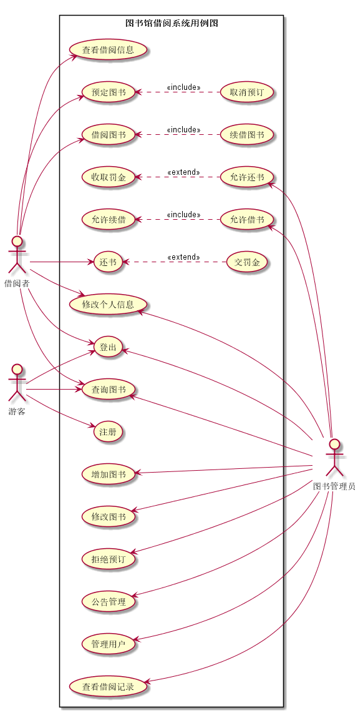

# 实验2：图书管理系统用例建模
|学号|班级|姓名|照片|
|:-------:|:-------------: | :----------:|:---:|
|201510414205|软件(本)15-2|黄伟||

## 1. 图书管理系统的用例关系图

### 1.1 用例图PlantUML源码如下：

``` usecase
@startuml test2
left to right direction
skinparam packageStyle rectangle
图书管理员 as manager
借阅者 as user
游客 as tourists
rectangle 图书馆借阅系统用例图 {
    tourists-->(注册)
    tourists-->(查询图书)
    tourists-->(登出)
    user-->(登出)
    user -->(查看借阅信息)
    user -->(预定图书)
    (预定图书)<..(取消预订):<<include>>
    user-->(借阅图书)
    (借阅图书)<..(续借图书):<<include>>
    user-->(还书)
    (还书)<..(交罚金):<<extend>>
    user-->(修改个人信息)
    user-->(查询图书)
    (登出)<--manager
    (修改个人信息)<--manager
    (增加图书)<--manager
    (修改图书)<--manager
    (查询图书)<--manager
    (拒绝预订)<--manager
    (公告管理)<--manager
    (管理用户)<--manager
    (查看借阅记录)<--manager
    (允许还书)<--manager
    (收取罚金)<..(允许还书):<<extend>>
    (允许借书)<--manager
    (允许续借)<..(允许借书):<<include>>
}
@enduml

```


### 1.2. 用例图如下：



## 2. 参与者说明：

###     2.1 图书管理员

主要职责是：***

###     2.2 读者

主要职责是：****

###     2.3 其他类型用户
    
主要职责是：****

##     3. 用例规约表

###     3.1 “借出图书”用例

参见：表7.5

###     3.2 “购入图书”用例

参见：表7.5

**“购入图书”用例流程图源码如下：**
``` uc1_flow
@startuml
start
:Hello world;
:This is on defined on
several **lines**;
stop
@enduml
```

**“购入图书”用例流程图源码如下：**


###     3.3 “***”用例

参见：表7.5
