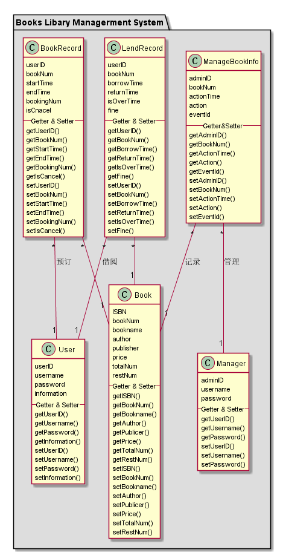

# 实验3：图书管理系统领域对象建模
|学号|班级|姓名|照片|
|:-------:|:-------------: | :----------:|:---:|
|201510414205|软件(本)15-2|黄伟||

### 1.1 PlantUML源码如下：

``` usecase
@startuml test3_1
package "Books Libary Managerment System" #DDD{
class Manager{
    adminID
    username
    password
    --Getter & Setter--
    getUserID()
    getUsername()
    getPassword()
    setUserID()
    setUsername()
    setPassword()
}

class User{
    userID
    username
    password
    information
    --Getter & Setter--
    getUserID()
    getUsername()
    getPassword()
    getInformation()
    setUserID()
    setUsername()
    setPassword()
    setInformation()
}

class Book{
    ISBN
    bookNum
    bookname
    author
    publisher
    price
    totalNum
    restNum
    --Getter & Setter--
    getISBN()
    getBookNum()
    getBookname()
    getAuthor()
    getPublicer()
    getPrice()
    getTotalNum()
    getRestNum()
    setISBN()
    setBookNum()
    setBookname()
    setAuthor()
    setPublicer()
    setPrice()
    setTotalNum()
    setRestNum()
}
class ManageBookInfo{
    adminID
    bookNum
    actionTime
    action
    eventId
    --Getter&Setter--
    getAdminID()
    getBookNum()
    getActionTime()
    getAction()
    getEventId()
    setAdminID()
    setBookNum()
    setActionTime()
    setAction()
    setEventId()
}
class LendRecord{
    userID
    bookNum
    borrowTime
    returnTime
    isOverTime
    fine
    --Getter & Setter--
    getUserID()
    getBookNum()
    getBorrowTime()
    getReturnTime()
    getIsOverTime()
    getFine()
    setUserID()
    setBookNum()
    setBorrowTime()
    setReturnTime()
    setIsOverTime()
    setFine()
}
class BookRecord{
    userID
    bookNum
    startTime
    endTime
    bookingNum
    isCnacel
    --Getter & Setter--
    getUserID()
    getBookNum()
    getStartTime()
    getEndTime()
    getBookingNum()
    getIsCancel()
    setUserID()
    setBookNum()
    setStartTime()
    setEndTime()
    setBookingNum()
    setIsCancel()
}
ManageBookInfo "*" -- "1" Manager:管理
ManageBookInfo "*" -- "1" Book:记录

LendRecord "*" -- "1" User:借阅
BookRecord "*" -- "1" User:预订

LendRecord "*" -- "1" Book
BookRecord "*" -- "1" Book
}
@enduml

```


### 1.2. 类图如下：


## 2. 图书管理系统的对象图

### 2.1 manager
```
@startUml manager
object Manager{
    userID:"admin"
    username:"赵三"
    password:"96E79218965EB72C"
    ----
    addBook()
    deleteBook()
    editBookInfo()
    editUserInfo()
    searchBook()
    findPassword()
    login()
    loginout()
}
@endUml
```

### 2.2 book
```
@startUml book
object Book{
    ISBN:"ISBN9787117130691"
    bookNum:"CDDX20151042XJ"
    bookname:"翻译美学理论"
    author:"刘宓庆"
    publisher:"外语教学与研究出版社"
    price:49.90
    totalNum:5
    restNum:3
}
@enduml
```

### 2.3 user
```
@startuml
object User{
    userID:"201510414222"
    username:李四"
    password:"1A100D2C0DAB19C4"
    information:"某大学信工学院学生"
    ----
    searchBook()
    bookingBook()
    cannelBook()
    editInformation()
    showLendRecords()
    findPassword()
    login()
    loginout()
}
@enduml
```

