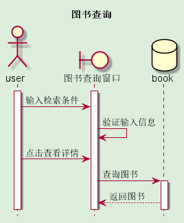
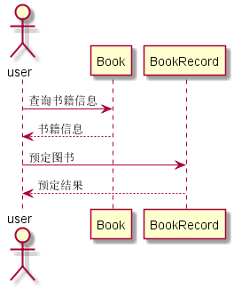
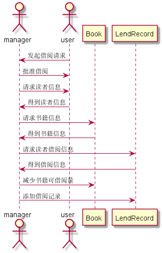
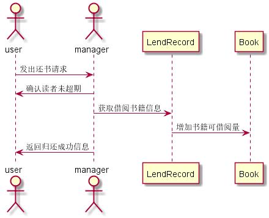
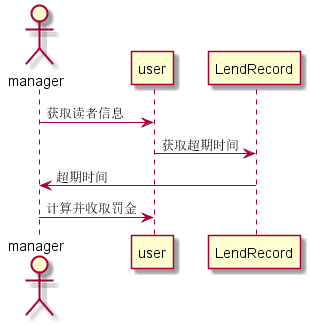

# 实验4：图书管理系统顺序图绘制
|学号|班级|姓名|照片|
|:-------:|:-------------: | :----------:|:---:|
|201510414205|软件(本)15-2|黄伟||

### 1.1 查询图书用例
#### 源码如下：

``` 
@startUml test4-1
title 图书查询
hide footbox
skinparam backgroundColor #ded
actor user
boundary 图书查询窗口
activate user
activate 图书查询窗口
user -> 图书查询窗口: 输入检索条件
图书查询窗口 -> 图书查询窗口: 验证输入信息
user -> 图书查询窗口: 点击查看详情
database book
图书查询窗口 -> book: 查询图书
activate book
book --> 图书查询窗口: 返回图书
@endUml
```
#### 用例顺序图


### 1.2 预订图书用例
#### 源码如下：
``` 
@startuml test4-2
actor user
user -> Book:查询书籍信息
user <-- Book:书籍信息
user -> BookRecord: 预定图书
user <-- BookRecord:预定结果
@enduml
```
#### 用例顺序图


### 1.3 借阅图书用例
#### 源码如下：
``` 
@startuml test4-3
actor manager
actor user
user -> manager:发起借阅请求
user <- manager:批准借阅
manager -> user:请求读者信息
manager <- user:得到读者信息
manager -> Book:请求书籍信息
manager <- Book:得到书籍信息
manager -> LendRecord:请求读者借阅信息
manager <- LendRecord:得到借阅信息
manager -> Book:减少书籍可借阅量
manager -> LendRecord:添加借阅记录
@enduml
```
#### 用例顺序图



#### 说明:
用户user向manager对象发起一个借阅某图书的请求,对象manager收到请求后批准借阅请求并向对象user发出对象发起获取读者信息的请求，对象user接收请求后返回该读者信息；然后参与者manager又向对象Book发起获取书籍信息请求，对象Book接收请求后返回该书籍的信息；然后参与者manager又向对象LendRecord发起读取读者借阅信息的请求，以获取该读者的借阅信息，参与者manager确认无误后向Book发起减少书籍可借数量请求，同时向LendRecord对象发起添加借阅记录的请求。
### 1.4 归还图书用例
#### 源码如下：
``` 
@startuml test4-4
actor user
actor manager
user -> manager:发出还书请求
manager -> user:确认读者未超期
manager ->LendRecord:获取借阅书籍信息
LendRecord -> Book:增加书籍可借阅量
user <- manager:返回归还成功信息
@enduml
```
#### 用例顺序图



#### 说明:
用户user向manager对象发起一个归还某图书的请求,对象manager收到请求后确认未超期并向对象user发起获取读者信息的请求，用户获取读者信息，接着再向LendRecord对象发起获取借阅书籍信息的请求，用于获取用户的借阅信息，并标注还书时间，最后向Book对象发起增加书籍可借阅量的请求，使得图书数量恢复至结束前的状态。最后manager对象向user返回归还成功.
### 1.5 收取罚金用例
#### 源码如下：
``` 
@startuml test4-5
actor manager
manager -> user:获取读者信息
user -> LendRecord:获取超期时间
LendRecord -> manager:超期时间
manager -> user:计算并收取罚金
@enduml
```
#### 用例顺序图



#### 说明:
管理员manager向用户user对象发起获取读者信息的请求，接着向LendRecord对象发起获取超期时间的请求，LendRecord对象接收请求后向参与者manager返回该用户的超期时间，根据超期时间计算罚金并向user收取.
