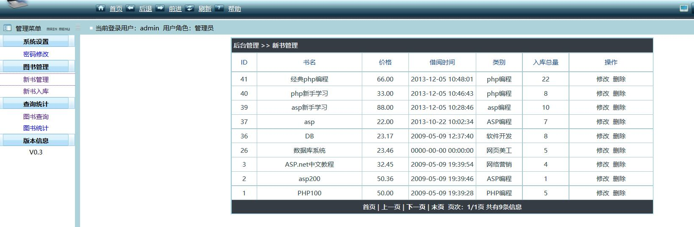

# 实验5：图书管理系统数据库设计与界面设计
|学号|班级|姓名|照片|
|:-------:|:-------------: | :----------:|:---:|
|201510414205|软件(本)15-2|黄伟||

### 1.数据库设计
#### 1.1 book表
|字段|类型|主键，外键|可以为空|默认值|约束|说明|
|:-------:|:-------------:|:------:|:----:|:---:|:----:|:-----|
|bookNum|varchar2(14)|主键|否| | | 图书编号|
|ISBN|varchar2(14)||否| | | 为书本印刷的ISBN号|
|bookName|varchar2(60)| |否|||书名|
|author|varchar2(50)| |是|||作者|
|publisher|varchar2(100)| |是|||出版社|
|price|double| |否|0.0||单价|
|totalNum|int| |否|0| |即该图书库存的总量|
|restNum|int| |否|0| |目前可借的图书量|
#### 1.2 user表
|字段|类型|主键，外键|可以为空|默认值|约束|说明|
|:-------:|:-------------:|:------:|:----:|:---:|:----:|:-----|
|userID|varchar2(14)|主键|否| | | 用户编号|
|username|varchar2(14)||否| | | 用户名|
|password|varchar2(60)| |否|||密码|
|information|varchar2(100)| |是|||个人简介|
#### 1.3 manager表
|字段|类型|主键，外键|可以为空|默认值|约束|说明|
|:-------:|:-------------:|:------:|:----:|:---:|:----:|:-----|
|adminID|varchar2(14)|主键|否| | | 管理员编号|
|username|varchar2(14)||否| | | 用户名|
|password|varchar2(60)| |否|||密码|
#### 1.4 ManageBookInfo表
|字段|类型|主键，外键|可以为空|默认值|约束|说明|
|:-------:|:-------------:|:------:|:----:|:---:|:----:|:-----|
|adminID|varchar2(14)|主键|否| | | 管理员编号|
|bookNum|varchar2(14)||否| | | 图书编号|
|actionTime|varchar2(60)| |否|||操作时间|
|action|varchar2(30)| |否|||操作|
|eventId|varchar2(14)| |否|||事件编号|
#### 1.5 LendRecord表
|字段|类型|主键，外键|可以为空|默认值|约束|说明|
|:-------:|:-------------:|:------:|:----:|:---:|:----:|:-----|
|userID|varchar2(14)|主键|否| | | 用户编号|
|bookNum|varchar2(14)||否| | | 图书编号|
|borrowTime|varchar2(30)| |否|||借阅时间|
|returnTime|varchar2(30)| |否|||归还时间|
|isOverTime|bool| |否|||是否超期|
|fine|float| |是|null||罚金|
#### 1.6 BookRecord表
|字段|类型|主键，外键|可以为空|默认值|约束|说明|
|:-------:|:-------------:|:------:|:----:|:---:|:----:|:-----|
|userID|varchar2(14)|主键|否| | | 用户编号|
|bookNum|varchar2(14)||否| | | 图书编号|
|startTime|varchar2(30)| |否|||预定借阅时间|
|endTime|varchar2(30)| |否|||预定归还时间|
|bookingNum|int| |否|0||预定数量|
|isCancel|bool| |否|||取消操作|
### 2 页面设计
#### 2.1图书管理系统原型

#### 2.2系统api
##### 2.2.1 列出所有图书接口 
- 功能：
   返回所有图书的json数据。   
   该接口服务于：http://localhost/phpbook0.3/admin/admin_index.php
- API请求地址： 
            http://localhost/phpbook0.3/admin/list.php
- 请求方式 ：
            GET  
- 请求参数说明:        
            无
- 返回实例：
~~~
 {
 "status": true,
 "info": null, 
 "total": 9,         
        "data": [
                  {"ID": "1", 
                  "BOOKNAME": "经典PHP编程", 
                  "CLASS": "php编程", 
                  "PRINCE": "66.00", 
                  "borrowTime": "2013-12-05 10:48:01", 
                  "restNum": "22", 
                  {
                     ...其他书籍
                  }
                ] 
  }
~~~
          
- 返回参数说明：    
 
|参数名称|说明|
|:---------:|:--------------------------------------------------------|      
|status|bool类型，true表示正确的返回，false表示有错误|
|info|返回结果说明信息|
|total|返回书籍总量|
|data|所有图书的数组|
|id|书籍id|
|bookname|书名|
|CLASS|类别|
|prince|本书单价|
|borrowTime|最近的节约时间|
|restNum|当前可借阅量|
##### 2.2.2 用户注册接口 
- 功能：
   用户注册。   
   该接口服务于：http://localhost/phpbook0.3/index.php
- API请求地址： 
            http://localhost/phpbook0.3/reg.php
- 请求方式 ：
            GET  
- 请求参数说明: 
            无
- 提交方式 ：
            POST
- 提交参数说明: 
  ~~~
  {
   "username":"admin",
   "password":"123",
   [other]:[other]
  }
  ~~~
- 提交参数说明：    
 
|参数名称|说明|
|:---------:|:--------------------------------------------------------|      
|username|用户名|
|password|密码|
|other|其他信息|
- 返回实例：
~~~
 {
 "status": true,       
 "result":"success"
  }
~~~
          
- 返回参数说明：    
 
|参数名称|说明|
|:---------:|:--------------------------------------------------------|      
|status|bool类型，true表示正确的返回，false表示有错误|
|result|success表示注册成功，faild表示注册失败|
##### 2.2.3 图书修改接口 
- 功能：
   返回所修改的图书信息。   
   该接口服务于：http://localhost/phpbook0.3/admin/admin_index.php
- API请求地址： 
            http://localhost/phpbook0.3/admin/modif.php
- 请求方式 ：
            GET  
- 请求参数说明: 
            无
- 提交方式 ：
            POST
- 提交参数说明: 
  ~~~
  {
   "bookNum":"CDDX123456",
   "bookName":"经典php编程",
   "class":"php编程",
   "author":"李四",
   "restnum":25,
   "publisher":"成都大学出版社",
   "price":"2.50"
  }
  ~~~
- 提交参数说明：    
 
|参数名称|说明|
|:---------:|:--------------------------------------------------------|      
|bookNum|图书编号|
|bookName|书名|
|author|作者|
|class|图书类别|
|price|单价|
|publisher|出版社|
|restnum|图书总量|
- 返回实例：
~~~
 {
 "status": true,       
 "result":"success"
  }
~~~
          
- 返回参数说明：    
 
|参数名称|说明|
|:---------:|:--------------------------------------------------------|      
|status|bool类型，true表示正确的返回，false表示有错误|
|result|success表示更新成功，faild表示更新失败|
##### 2.2.4 图书查询接口 
- 功能：
   返回符合条件的图书。   
   该接口服务于：http://localhost/phpbook0.3/search.php
- API请求地址： 
            http://localhost/phpbook0.3/search.php
- 请求方式 ：
            GET  
- 请求参数说明: 
            keyword
- 返回实例：
~~~
 {
 "status": true,
 "info": null, 
 "total": 8,         
        "data": [
                  {"ID": "1", 
                  "BOOKNAME": "经典PHP编程", 
                  "CLASS": "php编程", 
                  "PRINCE": "66.00", 
                  "borrowTime": "2013-12-05 10:48:01", 
                  "restNum": "22", 
                  {
                     ...其他书籍
                  }
                ] 
  }
~~~
          
- 返回参数说明：    
 
|参数名称|说明|
|:---------:|:--------------------------------------------------------|      
|status|bool类型，true表示正确的返回，false表示有错误|
|info|返回结果说明信息|
|total|返回书籍总量|
|data|所有图书的数组|
|id|书籍id|
|bookname|书名|
|CLASS|类别|
|prince|本书单价|
|borrowTime|最近的节约时间|
|restNum|当前可借阅量|
##### 其他说明
其他功能接口大抵与以上相似或相同，不再一一列举
