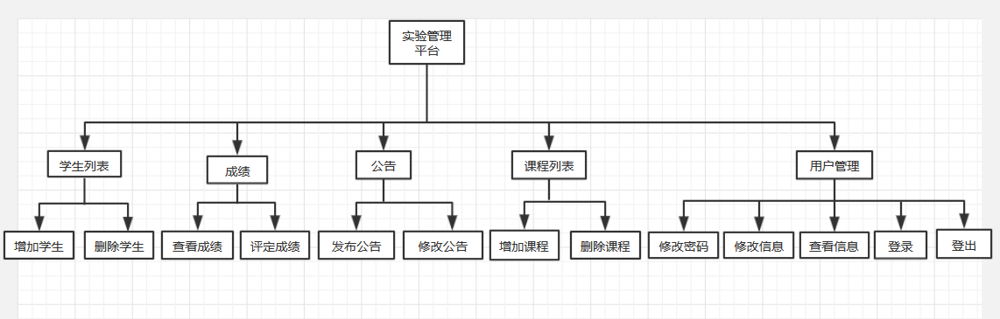
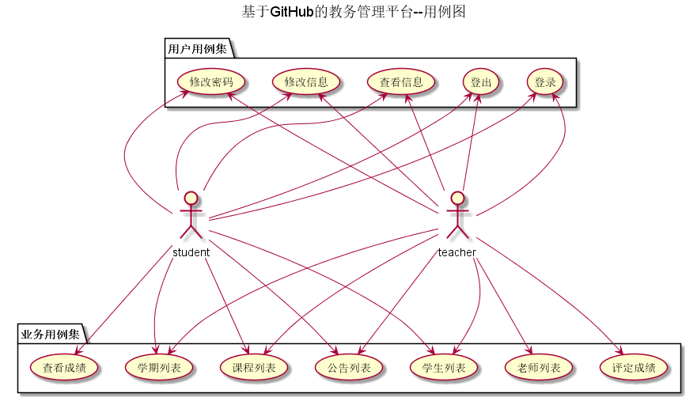
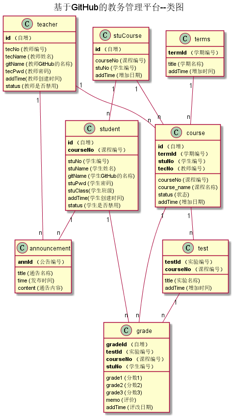

# 实验5：图书管理系统数据库设计与界面设计
## 成都大学信息科学与工程学院
|学号|班级|姓名|照片|
|:-------:|:-------------: | :----------:|:---:|
|201510414205|软件(本)15-2|黄伟||
## 1.概述
- 基于GitHub的实验管理平台的作用是在线管理实验成绩的Web应用系统。学生和老师的实验内容均存放在GitHUB
页面上。
- 学生的功能主要有：一是设置自己的GitHub用户名，二是查询自己的实验成绩。学生的GitHub用户名是公开的，但成绩不公开。
- 老师的功能主要有：一是批改每个学生的成绩，二是查看每个学生的成绩。
- 老师和学生都能通过本系统的链接方便地跳转到学生的每个GitHUB实验目录，以便批改实验或者查看实验情况。
- 实验成绩按数字分数计算，每项实验的满分为100分，最低为0分。
- 系统自动计算每个学生的所有实验的平均分。
## 2.系统总体结构

页面设计[visist it](./InterfaceDesign/README.md)
## 3.用例图设计 [源码](./code/%E5%9F%BA%E4%BA%8EGitHub%E7%9A%84%E6%95%99%E5%8A%A1%E7%AE%A1%E7%90%86%E5%B9%B3%E5%8F%B0--%E7%94%A8%E4%BE%8B%E5%9B%BE.wsd)

## 4.类图设计 [源码](./code/类图.wsd)

## 5.数据库设计 
### [visit it](./picture/类图.png)
## 6.用例及界面详细设计
### [visit it](./picture/类图.png)
