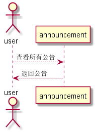

## “学生列表”用例

### 1. 用例规约

用例名称 | 公告列表
---|---
功能 | 以表形式的显示出所有公告
参与者 | 游客，学生，老师
前置条件 | 无
后置条件 | 
主事件流 | 
备选事件流 | 

### 2. 业务流程（顺序图）

### 3. 界面设计
- API接口调用
    - 接口1：[getStudent](../impl/getStudent.md)

### 4. 算法描述
无

### 5. 参照表
- [数据库设计](../数据库设计.md)
