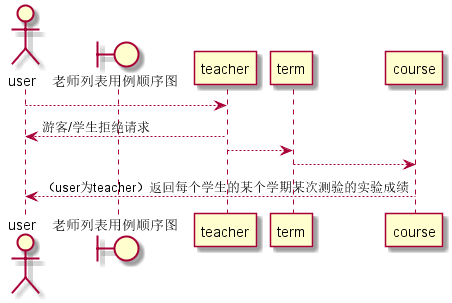

## “老师列表”用例

### 1. 用例规约

用例名称 | 老师列表
---|---
功能 | 以表形式的显示出所有老师的信息
参与者 | 老师
前置条件 | 老师需要先登录
后置条件 | 
主事件流 | 
备选事件流 | 

### 2. 业务流程（顺序图）

### 3. 界面设计

- API接口调用
    - 接口1：[getTeachers](../impl/getTeacher.md)

### 4. 算法描述
无
### 5. 参照表
- [数据库设计](../数据库设计.md)
